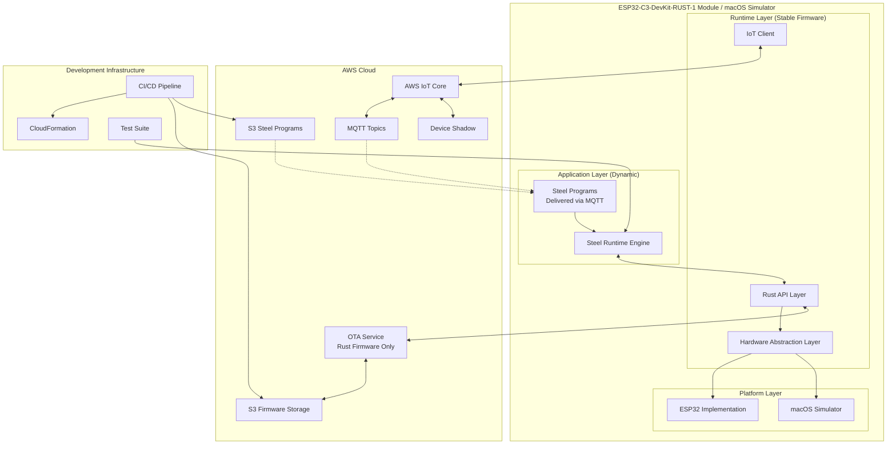
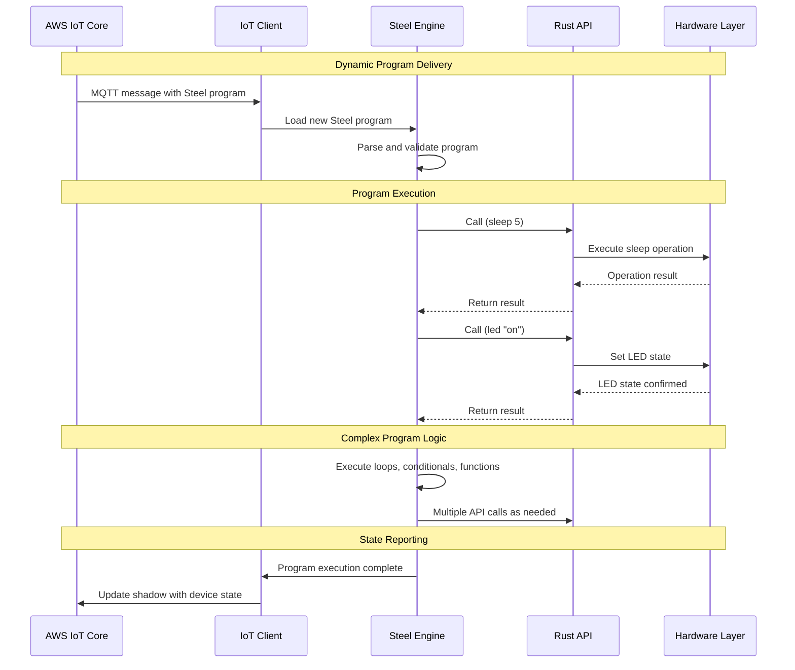
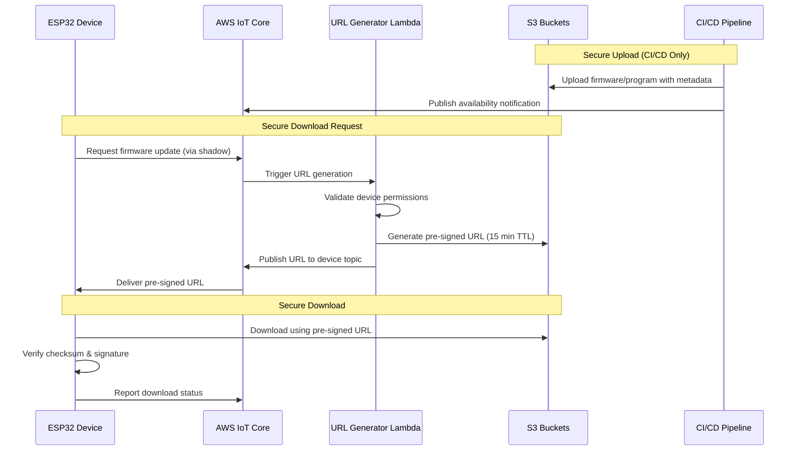
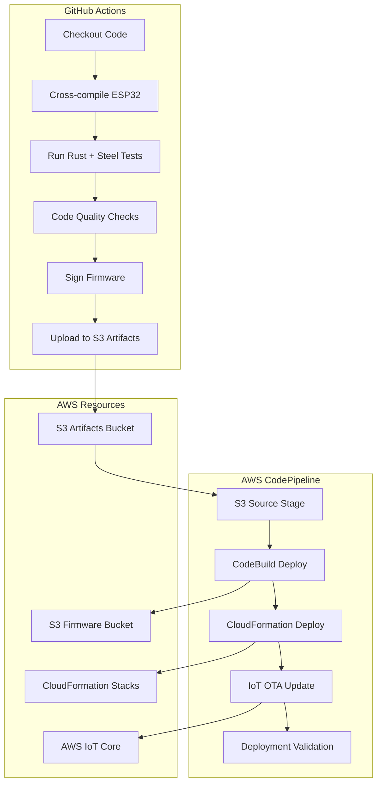

# Design Document

## Overview

The ESP32-IoT-Steel module is a dynamic embedded system where Steel (Scheme) serves as the primary programming environment for application logic, while Rust provides a minimal, stable runtime and hardware API layer. This architecture enables complex programs to be delivered and updated on-the-fly via AWS IoT MQTT without requiring firmware updates.

The system operates in two phases: a development/simulation phase running on macOS, and a production phase running on ESP32-C3-DevKit-RUST-1 hardware. The Rust firmware provides a stable foundation that rarely needs updates, while Steel programs can be dynamically loaded, executed, and replaced through AWS IoT shadow updates or direct MQTT messages.

The architecture follows a runtime-as-a-service approach where Rust exposes a comprehensive API to Steel, and Steel programs contain the actual application logic, control flow, and business rules. This design enables rapid iteration and deployment of complex embedded applications without the overhead and risk of firmware updates.

## Architecture

### High-Level Architecture



### Component Interaction Flow



## Components and Interfaces

### 1. Hardware Abstraction Layer (HAL)

**Purpose:** Provides unified interface for both ESP32 and macOS platforms

**Interface:**
```rust
pub trait PlatformHAL: Send + Sync {
    async fn sleep(&self, duration: Duration) -> Result<(), PlatformError>;
    async fn set_led(&self, state: LedState) -> Result<(), PlatformError>;
    async fn get_device_info(&self) -> DeviceInfo;
    async fn store_secure_data(&self, key: &str, data: &[u8]) -> Result<(), PlatformError>;
    async fn load_secure_data(&self, key: &str) -> Result<Vec<u8>, PlatformError>;
}

pub enum LedState {
    On,
    Off,
}

pub struct DeviceInfo {
    pub device_id: String,
    pub platform: String,
    pub version: String,
}
```

**Implementations:**
- `ESP32HAL`: Uses ESP-IDF APIs, secure element for storage
- `MacOSHAL`: Simulates operations with stdout logging, uses keychain for secure storage

### 2. Rust API Layer

**Purpose:** Provides comprehensive hardware and system API to Steel programs

**Interface:**
```rust
pub struct RustAPI {
    hal: Box<dyn PlatformHAL>,
    iot_client: Arc<IoTClient>,
    state_manager: Arc<StateManager>,
}

impl RustAPI {
    // Hardware Control API
    pub async fn sleep(&self, duration_secs: f64) -> Result<(), APIError>;
    pub async fn set_led(&self, state: bool) -> Result<(), APIError>;
    pub async fn get_sensor_data(&self) -> Result<SensorData, APIError>;
    
    // Communication API  
    pub async fn publish_mqtt(&self, topic: &str, payload: &str) -> Result<(), APIError>;
    pub async fn subscribe_mqtt(&self, topic: &str) -> Result<MQTTSubscription, APIError>;
    pub async fn update_shadow(&self, key: &str, value: serde_json::Value) -> Result<(), APIError>;
    
    // System API
    pub async fn get_device_info(&self) -> DeviceInfo;
    pub async fn get_uptime(&self) -> Duration;
    pub async fn get_memory_info(&self) -> MemoryInfo;
    pub async fn log(&self, level: LogLevel, message: &str);
    
    // Storage API
    pub async fn store_data(&self, key: &str, value: &str) -> Result<(), APIError>;
    pub async fn load_data(&self, key: &str) -> Result<Option<String>, APIError>;
    pub async fn delete_data(&self, key: &str) -> Result<(), APIError>;
    
    // Timer and Scheduling API
    pub async fn set_timer(&self, name: &str, duration_secs: f64, callback: SteelFunction) -> Result<TimerHandle, APIError>;
    pub async fn cancel_timer(&self, handle: TimerHandle) -> Result<(), APIError>;
    pub async fn schedule_task(&self, cron_expr: &str, task: SteelFunction) -> Result<TaskHandle, APIError>;
}
```

**Steel Function Bindings:**
- Hardware: `(sleep 5.5)`, `(led-on)`, `(led-off)`, `(read-sensors)`
- Communication: `(mqtt-publish "topic" "message")`, `(shadow-update "key" value)`
- System: `(device-info)`, `(uptime)`, `(memory-info)`, `(log "info" "message")`
- Storage: `(store "key" "value")`, `(load "key")`, `(delete "key")`
- Timers: `(set-timer "name" 10.0 callback-fn)`, `(schedule "0 */5 * * *" task-fn)`

### 3. Steel Runtime Integration

**Purpose:** Full-featured Scheme environment for complex application logic

**Interface:**
```rust
pub struct SteelRuntime {
    engine: steel::SteelVal,
    rust_api: Arc<RustAPI>,
    program_storage: ProgramStorage,
    execution_context: ExecutionContext,
}

impl SteelRuntime {
    pub fn new(rust_api: Arc<RustAPI>) -> Result<Self, SteelError>;
    
    // Program Management
    pub async fn load_program(&mut self, program: &str, name: Option<&str>) -> Result<ProgramHandle, SteelError>;
    pub async fn execute_program(&mut self, handle: ProgramHandle) -> Result<SteelValue, SteelError>;
    pub async fn execute_code(&mut self, code: &str) -> Result<SteelValue, SteelError>;
    pub fn list_programs(&self) -> Vec<ProgramInfo>;
    pub async fn remove_program(&mut self, handle: ProgramHandle) -> Result<(), SteelError>;
    
    // Runtime Management
    pub fn register_api_bindings(&mut self) -> Result<(), SteelError>;
    pub async fn set_global_variable(&mut self, name: &str, value: SteelValue) -> Result<(), SteelError>;
    pub async fn get_global_variable(&self, name: &str) -> Result<Option<SteelValue>, SteelError>;
    pub fn get_execution_stats(&self) -> ExecutionStats;
    
    // Event Handling
    pub async fn register_event_handler(&mut self, event: &str, handler: SteelFunction) -> Result<(), SteelError>;
    pub async fn emit_event(&mut self, event: &str, data: SteelValue) -> Result<(), SteelError>;
}
```

**Steel Programming Capabilities:**
- **Full Scheme Language:** Functions, macros, closures, tail recursion
- **Async Support:** Integration with Rust's async runtime
- **Event System:** Register handlers for MQTT messages, timers, sensor events
- **Module System:** Load and manage multiple Steel programs
- **Error Handling:** Comprehensive error reporting and recovery
- **Debugging:** Runtime inspection and logging capabilities

**Example Complex Steel Program:**
```scheme
;; IoT Sensor Monitoring and Alert System
(define (sensor-monitor)
  (let ((alert-threshold 75)
        (check-interval 30)
        (alert-cooldown 300))
    
    ;; Main monitoring loop
    (define (monitor-loop)
      (let ((sensor-data (read-sensors)))
        (log "info" (format "Sensor reading: ~a" sensor-data))
        
        ;; Check temperature threshold
        (when (> (get sensor-data 'temperature) alert-threshold)
          (handle-temperature-alert sensor-data))
        
        ;; Check battery level
        (when (< (get sensor-data 'battery) 20)
          (handle-low-battery sensor-data))
        
        ;; Schedule next check
        (set-timer "sensor-check" check-interval monitor-loop)))
    
    ;; Alert handling with cooldown
    (define (handle-temperature-alert data)
      (unless (load "last-temp-alert")
        (begin
          (led-on)
          (mqtt-publish "alerts/temperature" 
                       (json-encode data))
          (shadow-update "alert-status" "temperature-high")
          (store "last-temp-alert" (current-time))
          (set-timer "alert-cooldown" alert-cooldown clear-alert))))
    
    ;; Start monitoring
    (monitor-loop)))

;; Event handlers
(register-event-handler "mqtt-message" 
  (lambda (topic payload)
    (cond 
      [(string=? topic "commands/led")
       (if (string=? payload "on") (led-on) (led-off))]
      [(string=? topic "commands/sleep")
       (sleep (string->number payload))]
      [else (log "warn" (format "Unknown command topic: ~a" topic))])))

;; Start the sensor monitoring system
(sensor-monitor)
```

### 4. AWS IoT Integration

**Purpose:** Handles connectivity, program delivery, and state synchronization

**Interface:**
```rust
pub struct IoTClient {
    client: aws_iot_device_sdk::Client,
    device_id: String,
    shadow_handler: ShadowHandler,
    program_delivery: ProgramDeliveryHandler,
}

impl IoTClient {
    pub async fn connect(&mut self) -> Result<(), IoTError>;
    
    // Program Delivery
    pub async fn subscribe_to_program_topics(&mut self) -> Result<(), IoTError>;
    pub async fn handle_program_delivery(&self, message: ProgramMessage) -> Result<(), IoTError>;
    pub async fn request_program(&self, program_name: &str) -> Result<(), IoTError>;
    
    // State Management
    pub async fn update_shadow(&self, state: DeviceState) -> Result<(), IoTError>;
    pub async fn handle_shadow_update(&self, update: ShadowUpdate) -> Result<(), IoTError>;
    
    // Communication
    pub async fn publish(&self, topic: &str, payload: &str) -> Result<(), IoTError>;
    pub async fn subscribe(&self, topic: &str) -> Result<MQTTSubscription, IoTError>;
    
    // Secure Updates (Rust runtime only)
    pub async fn request_firmware_update(&self, version: &str) -> Result<(), IoTError>;
    pub async fn request_program_download(&self, program_id: &str) -> Result<(), IoTError>;
}

pub struct DeviceState {
    pub runtime_status: RuntimeStatus,
    pub active_programs: Vec<ProgramInfo>,
    pub hardware_state: HardwareState,
    pub system_info: SystemInfo,
    pub timestamp: DateTime<Utc>,
}

pub struct ProgramMessage {
    pub program_id: String,
    pub program_name: String,
    pub steel_code: String,
    pub version: String,
    pub checksum: String,
    pub auto_start: bool,
}

pub enum RuntimeStatus {
    Idle,
    ExecutingProgram { program_id: String, started_at: DateTime<Utc> },
    Error { message: String, timestamp: DateTime<Utc> },
}

pub struct HardwareState {
    pub led_status: bool,
    pub sleep_status: SleepStatus,
    pub sensor_data: Option<SensorData>,
    pub memory_usage: MemoryInfo,
}

pub enum SleepStatus {
    Awake,
    Sleeping { wake_time: DateTime<Utc> },
}
```

### 5. Security Layer

**Purpose:** Manages certificates, encryption, and secure communications

**Interface:**
```rust
pub struct SecurityManager {
    cert_store: Box<dyn CertificateStore>,
    crypto: Box<dyn CryptoProvider>,
}

pub trait CertificateStore: Send + Sync {
    async fn store_device_cert(&self, cert: &Certificate) -> Result<(), SecurityError>;
    async fn load_device_cert(&self) -> Result<Certificate, SecurityError>;
    async fn store_private_key(&self, key: &PrivateKey) -> Result<(), SecurityError>;
    async fn load_private_key(&self) -> Result<PrivateKey, SecurityError>;
}

pub trait CryptoProvider: Send + Sync {
    fn encrypt(&self, data: &[u8], key: &[u8]) -> Result<Vec<u8>, CryptoError>;
    fn decrypt(&self, data: &[u8], key: &[u8]) -> Result<Vec<u8>, CryptoError>;
    fn verify_signature(&self, data: &[u8], signature: &[u8], public_key: &[u8]) -> bool;
}
```

## Data Models

### Device Shadow Schema

```json
{
  "state": {
    "reported": {
      "runtime_status": {
        "status": "idle" | "executing" | "error",
        "current_program": "sensor-monitor-v2",
        "started_at": "2024-01-01T12:00:00Z",
        "error_message": null
      },
      "active_programs": [
        {
          "program_id": "prog-123",
          "name": "sensor-monitor-v2", 
          "version": "2.1.0",
          "status": "running",
          "loaded_at": "2024-01-01T11:30:00Z"
        }
      ],
      "hardware_state": {
        "led_status": true,
        "sleep_status": "awake",
        "wake_time": null,
        "sensor_data": {
          "temperature": 23.5,
          "humidity": 65.2,
          "battery": 87
        }
      },
      "system_info": {
        "firmware_version": "1.0.0",
        "platform": "esp32-c3-devkit-rust-1",
        "memory_free": 245760,
        "uptime_seconds": 3600,
        "steel_runtime_version": "0.5.0"
      }
    },
    "desired": {
      "programs": {
        "load": [
          {
            "program_id": "prog-124",
            "name": "alert-system-v3",
            "version": "3.0.0",
            "auto_start": true,
            "checksum": "sha256:def456...",
            "size_bytes": 8192,
            "request_id": "prog-req-456"
          }
        ],
        "unload": ["prog-122"],
        "start": ["prog-124"],
        "stop": ["prog-123"]
      },
      "firmware_update": {
        "version": "1.1.0",
        "request_id": "fw-req-789",
        "checksum": "sha256:abc123...",
        "size_bytes": 1048576
      }
    }
  }
}
```

### MQTT Topics for Program Delivery

```
# Program delivery (high-throughput)
steel-programs/{device_id}/load
steel-programs/{device_id}/execute
steel-programs/{device_id}/status

# Direct code execution (for small programs)
steel-programs/{device_id}/eval

# Program management
steel-programs/{device_id}/list
steel-programs/{device_id}/remove

# Broadcast programs (for fleet updates)
steel-programs/broadcast/load
steel-programs/broadcast/execute

# Secure download responses (pre-signed URLs)
downloads/{device_id}/firmware-url
downloads/{device_id}/program-url
```

### Secure Download Flow



### Lambda Function for Pre-signed URL Generation

```python
# AWS Lambda function (Python)
import boto3
import json
import hashlib
from datetime import datetime, timedelta

def lambda_handler(event, context):
    """
    Generate pre-signed URLs for secure firmware/program downloads
    Triggered by IoT Core when device requests download
    """
    
    # Extract request details from IoT event
    device_id = event['device_id']
    request_type = event['request_type']  # 'firmware' or 'program'
    resource_id = event['resource_id']    # version or program_id
    
    # Validate device permissions
    if not validate_device_permissions(device_id, request_type):
        return {'statusCode': 403, 'body': 'Access denied'}
    
    # Generate pre-signed URL
    s3_client = boto3.client('s3')
    bucket_name = get_bucket_name(request_type)
    object_key = get_object_key(request_type, resource_id)
    
    try:
        presigned_url = s3_client.generate_presigned_url(
            'get_object',
            Params={'Bucket': bucket_name, 'Key': object_key},
            ExpiresIn=900,  # 15 minutes
            HttpMethod='GET'
        )
        
        # Publish URL to device-specific topic
        iot_client = boto3.client('iot-data')
        response_topic = f"downloads/{device_id}/{request_type}-url"
        
        payload = {
            'request_id': event['request_id'],
            'download_url': presigned_url,
            'expires_at': (datetime.utcnow() + timedelta(minutes=15)).isoformat(),
            'checksum': get_object_checksum(bucket_name, object_key),
            'size_bytes': get_object_size(bucket_name, object_key)
        }
        
        iot_client.publish(
            topic=response_topic,
            payload=json.dumps(payload)
        )
        
        return {'statusCode': 200, 'body': 'URL generated successfully'}
        
    except Exception as e:
        return {'statusCode': 500, 'body': f'Error: {str(e)}'}
```

### Steel Program Package Format

```json
{
  "program_id": "prog-124",
  "name": "sensor-alert-system",
  "version": "3.0.0",
  "description": "Advanced sensor monitoring with ML predictions",
  "author": "IoT Team",
  "created_at": "2024-01-01T10:00:00Z",
  "dependencies": [],
  "steel_code": "(define (main) ...)",
  "checksum": "sha256:...",
  "metadata": {
    "memory_requirement": 32768,
    "execution_timeout": 3600,
    "auto_restart": true,
    "priority": "normal"
  }
}

### Configuration Schema

```rust
#[derive(Serialize, Deserialize)]
pub struct DeviceConfig {
    pub device_id: String,
    pub aws_region: String,
    pub iot_endpoint: String,
    pub thing_name: String,
    pub certificate_path: Option<String>, // Only for development
    pub log_level: LogLevel,
    pub ota_enabled: bool,
    pub steel_timeout_seconds: u64,
}
```

## Error Handling

### Error Hierarchy

```rust
#[derive(Debug, thiserror::Error)]
pub enum SystemError {
    #[error("Platform error: {0}")]
    Platform(#[from] PlatformError),
    
    #[error("Steel runtime error: {0}")]
    Steel(#[from] SteelError),
    
    #[error("IoT communication error: {0}")]
    IoT(#[from] IoTError),
    
    #[error("Security error: {0}")]
    Security(#[from] SecurityError),
    
    #[error("Command execution error: {0}")]
    Command(#[from] CommandError),
}
```

### Error Recovery Strategies

1. **Network Errors:** Exponential backoff with jitter for AWS IoT reconnection
2. **Steel Errors:** Isolate script execution, report errors to shadow, continue operation
3. **Command Errors:** Log error, update shadow with error state, allow retry
4. **Security Errors:** Fail securely, require manual intervention for certificate issues
5. **OTA Errors:** Rollback to previous firmware version, report failure to cloud

## Testing Strategy

### Dual Testing Architecture

The system implements a comprehensive dual testing approach with both Rust and Steel/Scheme tests to ensure functionality is validated from both perspectives:

1. **Rust Tests**: Test the Rust API layer, Steel runtime integration, and system components directly
2. **Steel Tests**: Test functionality from the Steel program perspective, validating the complete API surface

### Test Directory Structure

```
tests/
├── rust/                    # Rust unit and integration tests
│   ├── test_led_control.rs
│   ├── test_sleep_function.rs
│   └── test_device_info.rs
├── steel/                   # Steel/Scheme test programs
│   ├── test_led_control.scm
│   ├── test_sleep_function.scm
│   ├── test_device_info.scm
│   ├── test_logging.scm
│   └── test_complex_program.scm
examples/
├── rust/                    # Rust example programs
│   └── blink_led.rs
└── steel/                   # Steel example programs
    ├── blink_led.scm
    ├── system_monitor.scm
    └── interactive_demo.scm
```

### Steel Test Runner

**Interface:**
```rust
pub struct SteelTestRunner {
    runtime: SteelRuntime,
}

impl SteelTestRunner {
    pub fn new(hal: Arc<dyn PlatformHAL>) -> SystemResult<Self>;
    pub async fn run_test_file(&self, file_path: &Path) -> SystemResult<()>;
    pub async fn run_tests_in_directory(&self, dir_path: &Path) -> SystemResult<TestResults>;
    pub async fn run_example_file(&self, file_path: &Path) -> SystemResult<()>;
}

pub struct TestResults {
    pub total: usize,
    pub passed: usize,
    pub failed: usize,
}
```

### Test Commands

**Cargo Commands:**
```bash
# Run only Rust tests
cargo test --workspace

# Run only Steel tests  
cargo run --bin steel_test

# Run specific Steel test
cargo run --bin steel_test -- --file tests/steel/test_led_control.scm

# Run Steel examples
cargo run --bin steel_example

# Run specific Steel example
cargo run --bin steel_example -- --file examples/steel/blink_led.scm
```

**Makefile Commands:**
```bash
# Individual test suites
make test-rust      # Run Rust tests only
make test-steel     # Run Steel tests only
make test-all       # Run both Rust and Steel tests

# Examples
make examples-steel # Run Steel examples
make examples-all   # Run all examples
```

### Unit Tests

**Rust Command Testing:**
```rust
#[cfg(test)]
mod tests {
    use super::*;
    use mockall::predicate::*;
    
    #[tokio::test]
    async fn test_sleep_command() {
        let mut mock_hal = MockPlatformHAL::new();
        mock_hal.expect_sleep()
            .with(eq(Duration::from_secs(5)))
            .times(1)
            .returning(|_| Ok(()));
            
        let cmd = SleepCommand::new();
        let result = cmd.execute(
            CommandArgs::new(vec!["5".to_string()]), 
            &mock_hal
        ).await;
        
        assert!(result.is_ok());
    }
}
```

**Steel Test Example:**
```scheme
;; tests/steel/test_led_control.scm
(begin
  (log-info "Starting LED control test")
  
  ;; Test LED on
  (let ((result (led-on)))
    (if result
        (log-info "LED on test: PASSED")
        (error "LED on returned false")))
  
  ;; Test LED off
  (let ((result (led-off)))
    (if (not result)
        (log-info "LED off test: PASSED")
        (error "LED off returned true")))
  
  ;; Test LED state query
  (let ((state (led-state)))
    (if (not state)
        (log-info "LED state test: PASSED")
        (error "LED state should be false after turning off")))
  
  (log-info "LED control test completed successfully")
  #t)
```

**Steel Integration Testing:**
```rust
#[tokio::test]
async fn test_steel_complex_program() {
    let rust_api = Arc::new(RustAPI::new_mock());
    let mut steel = SteelRuntime::new(rust_api).unwrap();
    
    let program = r#"
        (define (sensor-loop count)
          (if (> count 0)
              (begin
                (let ((data (read-sensors)))
                  (log "info" (format "Reading ~a: temp=~a" 
                                     count (get data 'temperature)))
                  (when (> (get data 'temperature) 25)
                    (led-on))
                  (sleep 1)
                  (sensor-loop (- count 1))))
              (led-off)))
        
        (sensor-loop 5)
    "#;
    
    let result = steel.execute_code(program).await;
    assert!(result.is_ok());
    
    // Verify API calls were made
    let api_calls = rust_api.get_call_history();
    assert!(api_calls.contains(&"read-sensors"));
    assert!(api_calls.contains(&"log"));
    assert!(api_calls.contains(&"sleep"));
}
```

### Integration Tests

**AWS IoT Program Delivery Integration:**
```rust
#[tokio::test]
async fn test_iot_program_delivery() {
    let config = TestConfig::load();
    let mut client = IoTClient::new(config).await.unwrap();
    let steel_runtime = Arc::new(Mutex::new(SteelRuntime::new(rust_api).unwrap()));
    
    client.connect().await.unwrap();
    client.subscribe_to_program_topics().await.unwrap();
    
    // Send complex Steel program via MQTT
    let program_package = ProgramPackage {
        program_id: "test-prog-001".to_string(),
        name: "integration-test".to_string(),
        steel_code: r#"
            (define (test-sequence)
              (begin
                (log "info" "Starting integration test")
                (led-on)
                (sleep 1)
                (let ((sensors (read-sensors)))
                  (shadow-update "test-result" 
                                (json-encode sensors)))
                (led-off)
                (log "info" "Integration test complete")))
            
            (test-sequence)
        "#.to_string(),
        version: "1.0.0".to_string(),
        auto_start: true,
        ..Default::default()
    };
    
    // Simulate program delivery
    client.publish(
        &format!("steel-programs/{}/load", client.device_id()),
        &serde_json::to_string(&program_package).unwrap()
    ).await.unwrap();
    
    // Wait for execution and verify results
    tokio::time::sleep(Duration::from_secs(5)).await;
    
    let shadow = client.get_shadow().await.unwrap();
    assert_eq!(shadow.reported.runtime_status.status, "idle");
    assert!(shadow.reported.test_result.is_some());
    
    // Verify program was loaded and executed
    let programs = shadow.reported.active_programs;
    assert!(programs.iter().any(|p| p.name == "integration-test"));
}
```

### Performance Tests

- **Memory Usage:** Monitor heap allocation during Steel program execution
- **Network Latency:** Measure AWS IoT round-trip times
- **Command Execution Time:** Benchmark individual command performance
- **Concurrent Operations:** Test multiple Steel programs and shadow updates

### Security Tests

- **Certificate Validation:** Test invalid certificates are rejected
- **Encrypted Storage:** Verify secure data cannot be read without proper keys
- **Network Security:** Validate TLS configuration and cipher suites
- **Input Validation:** Test Steel program parsing with malicious inputs

## Platform-Specific Implementation Details

### ESP32-C3-DevKit-RUST-1 Implementation

**Dependencies:**
- `esp-idf-sys` for low-level ESP-IDF bindings
- `esp32c3-hal` for ESP32-C3 hardware abstraction
- `embedded-tls` for secure communications
- `esp-ota` for over-the-air updates

**Memory Management:**
- Use `heapless` collections for embedded-friendly data structures
- Implement custom allocator for Steel runtime with memory limits
- Monitor stack usage for async operations

**Security Features:**
- Utilize ESP32-C3 secure boot and flash encryption
- Store certificates in encrypted NVS (Non-Volatile Storage)
- Use hardware random number generator for cryptographic operations

### macOS Simulation Implementation

**Dependencies:**
- `tokio` for async runtime
- `security-framework` for keychain access
- `aws-sdk-iot` for cloud integration
- Standard Steel crate for full Scheme support

**Simulation Features:**
- File-based configuration for easy development
- Detailed logging with `tracing` crate
- Mock hardware responses with configurable delays
- Integration with macOS notification system for status updates

## Deployment Architecture

### Hybrid CI/CD Architecture

The system uses a hybrid CI/CD approach that leverages the strengths of both GitHub Actions and AWS native services:

**GitHub Actions Responsibilities:**
- Rust cross-compilation for ESP32-C3-DevKit-RUST-1
- Running comprehensive test suites (Rust + Steel)
- Code quality checks (clippy, rustfmt, security audits)
- Firmware signing and artifact creation
- Secure artifact transfer to AWS S3

**AWS CodePipeline/CodeBuild Responsibilities:**
- CloudFormation stack deployment and updates
- AWS IoT configuration and device provisioning
- Steel program packaging and distribution
- OTA deployment orchestration
- Infrastructure validation and rollback



### CloudFormation Infrastructure

**Resources:**
- IoT Thing and Thing Type definitions
- IoT Policies with minimal required permissions
- Certificate provisioning (development only)
- S3 buckets with strict access controls and versioning
- IAM roles with least-privilege access
- Lambda functions for pre-signed URL generation
- CloudWatch logs for monitoring and debugging
- CodePipeline and CodeBuild projects for AWS-side automation

**Hybrid Security Architecture:**
```mermaid
graph TB
    subgraph "GitHub Actions"
        GitHubOIDC[GitHub OIDC Provider]
        GitHubSecrets[GitHub Secrets]
    end
    
    subgraph "S3 Buckets (Private)"
        ArtifactsBucket[Build Artifacts Bucket<br/>esp32-build-artifacts-{env}]
        FirmwareBucket[Firmware Bucket<br/>esp32-firmware-{env}]
        ProgramBucket[Steel Programs Bucket<br/>steel-programs-{env}]
    end
    
    subgraph "Access Control"
        GitHubRole[GitHub Actions IAM Role<br/>Artifacts Upload Only]
        CodeBuildRole[CodeBuild IAM Role<br/>Infrastructure Management]
        DeviceRole[Device IAM Role<br/>No Direct Access]
        URLLambda[Pre-signed URL Lambda<br/>Read Only]
    end
    
    subgraph "AWS CodePipeline"
        Pipeline[CodePipeline]
        BuildProject[CodeBuild Project]
    end
    
    subgraph "Secure Distribution"
        PreSignedURLs[Pre-signed URLs<br/>Time-limited, Device-specific]
        IoTCore[AWS IoT Core<br/>URL Distribution]
    end
    
    GitHubOIDC --> GitHubRole
    GitHubRole -->|Upload Only| ArtifactsBucket
    
    ArtifactsBucket --> Pipeline
    Pipeline --> BuildProject
    CodeBuildRole --> FirmwareBucket
    CodeBuildRole --> ProgramBucket
    
    URLLambda -->|Generate URLs| PreSignedURLs
    URLLambda -->|Read Access| FirmwareBucket
    URLLambda -->|Read Access| ProgramBucket
    
    IoTCore -->|Deliver URLs| PreSignedURLs
    DeviceRole -->|Request via IoT| IoTCore
```

**Security Configuration:**
- **GitHub Actions:** OIDC provider with minimal IAM role for S3 artifact upload only
- **S3 Bucket Policies:** Deny all public access, GitHub upload-only, CodeBuild read/write, Lambda read-only
- **IAM Role Separation:** GitHub Actions upload permissions, CodeBuild infrastructure permissions, devices no direct S3 access
- **Pre-signed URLs:** Time-limited (15 minutes), device-specific, single-use
- **CodePipeline Security:** Dedicated service roles with minimal required permissionsT Core triggers Lambda to generate URLs for authenticated devices
- **Encryption:** S3 server-side encryption with KMS keys
- **Versioning:** Immutable firmware/program versions with audit trail

### CI/CD Pipeline

**Build Stages:**
1. **Code Quality:** Clippy, rustfmt, security audit
2. **Unit Tests:** Run all unit tests with coverage reporting
3. **Cross-Compilation:** Build for both x86_64-apple-darwin and riscv32imc-esp-espidf
4. **Integration Tests:** Run against test AWS IoT environment
5. **Firmware Packaging:** Create signed firmware images
6. **Deployment:** Upload to S3 and trigger OTA updates

**IAM Policies:**

```json
{
  "CI/CD Role Policy": {
    "Version": "2012-10-17",
    "Statement": [
      {
        "Effect": "Allow",
        "Action": [
          "s3:PutObject",
          "s3:PutObjectAcl"
        ],
        "Resource": [
          "arn:aws:s3:::esp32-firmware-prod/*",
          "arn:aws:s3:::steel-programs-prod/*"
        ]
      },
      {
        "Effect": "Allow",
        "Action": [
          "iot:Publish"
        ],
        "Resource": [
          "arn:aws:iot:*:*:topic/firmware/available",
          "arn:aws:iot:*:*:topic/programs/available"
        ]
      }
    ]
  },
  
  "Device Role Policy": {
    "Version": "2012-10-17",
    "Statement": [
      {
        "Effect": "Allow",
        "Action": [
          "iot:Connect",
          "iot:Publish",
          "iot:Subscribe",
          "iot:Receive"
        ],
        "Resource": [
          "arn:aws:iot:*:*:client/${iot:Connection.Thing.ThingName}",
          "arn:aws:iot:*:*:topic/$aws/things/${iot:Connection.Thing.ThingName}/*",
          "arn:aws:iot:*:*:topic/downloads/${iot:Connection.Thing.ThingName}/*",
          "arn:aws:iot:*:*:topic/steel-programs/${iot:Connection.Thing.ThingName}/*"
        ]
      }
    ]
  },
  
  "Lambda Role Policy": {
    "Version": "2012-10-17",
    "Statement": [
      {
        "Effect": "Allow",
        "Action": [
          "s3:GetObject",
          "s3:GetObjectVersion"
        ],
        "Resource": [
          "arn:aws:s3:::esp32-firmware-prod/*",
          "arn:aws:s3:::steel-programs-prod/*"
        ]
      },
      {
        "Effect": "Allow",
        "Action": [
          "iot:Publish"
        ],
        "Resource": [
          "arn:aws:iot:*:*:topic/downloads/*/firmware-url",
          "arn:aws:iot:*:*:topic/downloads/*/program-url"
        ]
      }
    ]
  }
}
```

**S3 Bucket Policies:**

```json
{
  "Version": "2012-10-17",
  "Statement": [
    {
      "Sid": "DenyPublicAccess",
      "Effect": "Deny",
      "Principal": "*",
      "Action": "s3:*",
      "Resource": [
        "arn:aws:s3:::esp32-firmware-prod",
        "arn:aws:s3:::esp32-firmware-prod/*"
      ],
      "Condition": {
        "Bool": {
          "aws:SecureTransport": "false"
        }
      }
    },
    {
      "Sid": "AllowCICDUpload",
      "Effect": "Allow",
      "Principal": {
        "AWS": "arn:aws:iam::ACCOUNT:role/ESP32-CICD-Role"
      },
      "Action": [
        "s3:PutObject",
        "s3:PutObjectAcl"
      ],
      "Resource": "arn:aws:s3:::esp32-firmware-prod/*"
    },
    {
      "Sid": "AllowLambdaRead",
      "Effect": "Allow",
      "Principal": {
        "AWS": "arn:aws:iam::ACCOUNT:role/ESP32-URLGenerator-Role"
      },
      "Action": [
        "s3:GetObject",
        "s3:GetObjectVersion"
      ],
      "Resource": "arn:aws:s3:::esp32-firmware-prod/*"
    }
  ]
}
```

**Artifacts:**
- Firmware binaries for ESP32-C3-DevKit-RUST-1 (uploaded to secure S3)
- macOS simulator binaries for development
- CloudFormation templates with security policies
- Lambda functions for secure URL generation
- Test reports and coverage data
- Security audit reports and compliance documentation