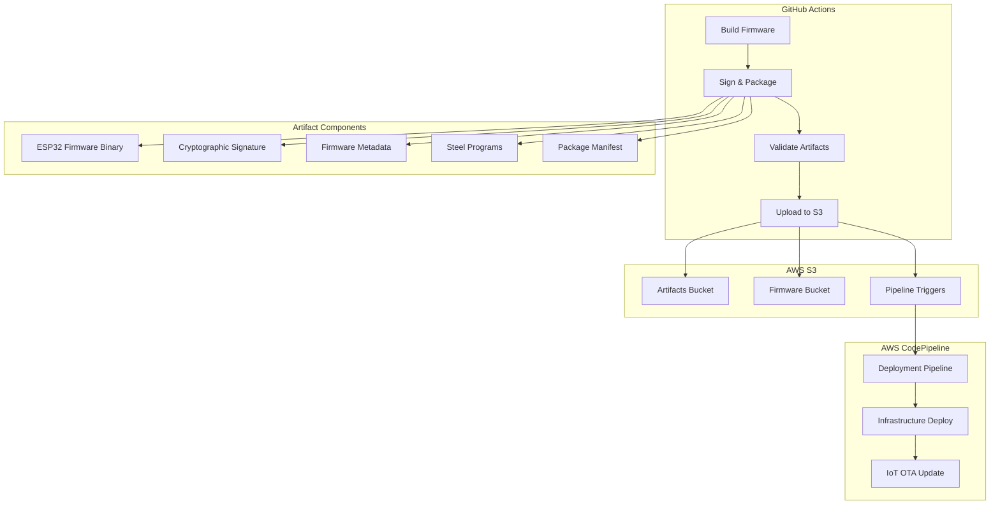

# Secure Artifact Management

This document describes the secure artifact management system for the AWS IoT Steel project, including firmware signing, packaging, validation, and deployment processes.

## Overview

The artifact management system provides:

- **Secure Firmware Signing**: Cryptographic signing of ESP32 firmware binaries
- **Steel Program Packaging**: Bundling of Steel (Scheme) programs with metadata
- **Artifact Validation**: Comprehensive validation of all artifacts before deployment
- **AWS S3 Integration**: Secure upload to S3 with proper versioning and metadata
- **CodePipeline Triggering**: Automatic triggering of AWS CodePipeline for deployment

## Architecture



## Components

### 1. Firmware Signing Script (`scripts/sign-firmware.sh`)

**Purpose**: Signs firmware binaries and creates comprehensive artifact packages.

**Features**:
- RSA-PSS-SHA256 signature generation
- Firmware metadata generation with build information
- Steel program packaging with JSON metadata
- Comprehensive artifact validation
- Development and production signing modes

**Usage**:
```bash
./scripts/sign-firmware.sh <firmware-dir> <output-dir>
```

**Environment Variables**:
- `FIRMWARE_SIGNING_KEY`: Base64-encoded private key for production signing
- `FIRMWARE_PUBLIC_KEY`: Base64-encoded public key for signature verification
- `GITHUB_SHA`: Git commit hash for version tracking
- `GITHUB_REF_NAME`: Git branch name

**Output Structure**:
```
signed-artifacts/
├── aws-iot-platform-esp32.bin          # Firmware binary
├── aws-iot-platform-esp32.bin.sig      # Cryptographic signature
├── firmware-metadata.json              # Firmware metadata
├── steel-programs/                      # Steel program packages
│   ├── system_monitor.json
│   └── interactive_demo.json
├── aws-iot-steel-artifacts-<version>.tar.gz  # Complete package
└── package-manifest.json               # Package manifest
```

### 2. Artifact Validation Script (`scripts/validate-artifacts.sh`)

**Purpose**: Validates all artifacts before deployment to ensure integrity and security.

**Validation Checks**:
- Package manifest validation (JSON format, required fields)
- Package file integrity (tar.gz format, checksum verification)
- Firmware metadata validation (required fields, format validation)
- Firmware binary validation (size limits, checksum verification)
- Signature validation (development vs production signatures)
- Steel programs validation (JSON format, required fields)
- Security scanning (sensitive information detection)
- Version consistency across all components

**Usage**:
```bash
./scripts/validate-artifacts.sh <artifacts-dir> <validation-mode>
```

**Validation Modes**:
- `strict`: All warnings treated as failures (production)
- `permissive`: Warnings allowed (staging)
- `development`: Development signatures accepted

### 3. AWS Upload Script (`scripts/upload-to-aws.sh`)

**Purpose**: Securely uploads artifacts to AWS S3 and triggers CodePipeline.

**Features**:
- Multi-bucket upload strategy (artifacts and firmware)
- Comprehensive metadata tagging
- CodePipeline trigger generation
- Pre-signed URL generation for verification
- Deployment stage management (development/staging/production)

**Usage**:
```bash
./scripts/upload-to-aws.sh <artifacts-dir>
```

**Environment Variables**:
- `AWS_REGION`: Target AWS region
- `S3_ARTIFACTS_BUCKET`: S3 bucket for build artifacts
- `S3_FIRMWARE_BUCKET`: S3 bucket for firmware distribution
- `DEPLOYMENT_STAGE`: Deployment stage (development/staging/production)
- `CODEPIPELINE_NAME`: CodePipeline name for direct triggering

## Security Model

### Signing Keys

**Production Environment**:
- Private signing key stored in GitHub Secrets as `FIRMWARE_SIGNING_KEY`
- Public verification key stored in GitHub Secrets as `FIRMWARE_PUBLIC_KEY`
- Keys are base64-encoded for secure storage
- RSA-PSS-SHA256 signature algorithm for maximum security

**Development Environment**:
- Deterministic development signatures based on firmware checksum
- Clear marking of development vs production signatures
- Validation scripts detect and handle development signatures appropriately

### AWS Access Control

**GitHub Actions OIDC**:
- No long-term AWS credentials stored in GitHub
- Temporary credentials via OIDC provider
- Minimal IAM permissions (S3 upload only)
- Session-based access with automatic expiration

**S3 Bucket Security**:
- Encryption at rest (AES-256)
- Versioning enabled for artifact history
- Access logging for audit trails
- Bucket policies deny public access
- HTTPS-only access enforced

### Artifact Integrity

**Checksums**:
- SHA-256 checksums for all artifacts
- Checksum verification at multiple stages
- Manifest-based integrity checking

**Signatures**:
- Cryptographic signatures for firmware binaries
- Signature verification before deployment
- Chain of trust from build to deployment

## GitHub Actions Integration

### Workflow Stages

1. **Code Quality**: Formatting, linting, security audit
2. **Testing**: Rust tests, Steel tests, Linux platform tests
3. **Cross-Compilation**: ESP32-C3 target compilation
4. **Build and Sign**: Firmware signing and packaging
5. **Validation**: Comprehensive artifact validation
6. **AWS Upload**: Secure S3 upload and pipeline triggering

### Secrets Configuration

Required GitHub Secrets:
```yaml
AWS_GITHUB_ACTIONS_ROLE_ARN: arn:aws:iam::ACCOUNT:role/GitHubActionsRole
AWS_REGION: us-east-1
S3_BUILD_ARTIFACTS_BUCKET: aws-iot-steel-artifacts-prod
S3_FIRMWARE_BUCKET: aws-iot-steel-firmware-prod
CODEPIPELINE_NAME: aws-iot-steel-deployment
FIRMWARE_SIGNING_KEY: <base64-encoded-private-key>
FIRMWARE_PUBLIC_KEY: <base64-encoded-public-key>
```

### Branch Strategy

- **main**: Production deployments with strict validation
- **develop**: Development deployments with permissive validation
- **feature/***: No deployment, testing only

## Artifact Formats

### Package Manifest (`package-manifest.json`)

```json
{
  "package_name": "aws-iot-steel-artifacts-a1b2c3d4.tar.gz",
  "package_version": "a1b2c3d4",
  "package_size": 2048576,
  "package_checksum": "sha256:...",
  "created_at": "2024-01-01T12:00:00Z",
  "contents": {
    "firmware_binary": "aws-iot-platform-esp32.bin",
    "firmware_signature": "aws-iot-platform-esp32.bin.sig",
    "firmware_metadata": "firmware-metadata.json",
    "steel_programs": ["system_monitor.json", "interactive_demo.json"]
  },
  "deployment_info": {
    "target_platform": "esp32-c3-devkit-rust-1",
    "aws_region": "us-east-1",
    "deployment_stage": "production"
  }
}
```

### Firmware Metadata (`firmware-metadata.json`)

```json
{
  "version": "a1b2c3d4",
  "target": "esp32-c3-devkit-rust-1",
  "size_bytes": 1048576,
  "checksum_sha256": "sha256:...",
  "build_timestamp": "2024-01-01T12:00:00Z",
  "git_commit": "a1b2c3d4e5f6...",
  "git_branch": "main",
  "build_environment": {
    "os": "Linux",
    "arch": "x86_64",
    "rust_version": "rustc 1.75.0",
    "cargo_version": "cargo 1.75.0"
  },
  "security": {
    "signed": true,
    "signature_algorithm": "RSA-PSS-SHA256",
    "signing_timestamp": "2024-01-01T12:00:00Z"
  }
}
```

### Steel Program Package

```json
{
  "program_id": "steel-system_monitor-a1b2c3d4",
  "name": "system_monitor",
  "version": "a1b2c3d4",
  "description": "Steel program: system_monitor",
  "author": "AWS IoT Steel Team",
  "created_at": "2024-01-01T12:00:00Z",
  "steel_code": "(define (main) ...)",
  "checksum_sha256": "sha256:...",
  "size_bytes": 4096,
  "metadata": {
    "memory_requirement": 32768,
    "execution_timeout": 3600,
    "auto_restart": false,
    "priority": "normal"
  }
}
```

## S3 Storage Structure

### Artifacts Bucket

```
s3://aws-iot-steel-artifacts-prod/
├── builds/
│   └── <version>/
│       ├── aws-iot-steel-artifacts-<version>.tar.gz
│       └── package-manifest.json
├── triggers/
│   └── <stage>/
│       └── deployment-<deployment-id>.json
└── latest/
    └── <stage>/
        └── version.json
```

### Firmware Bucket

```
s3://aws-iot-steel-firmware-prod/
├── firmware/
│   └── <version>/
│       ├── aws-iot-platform-esp32.bin
│       ├── aws-iot-platform-esp32.bin.sig
│       └── firmware-metadata.json
└── steel-programs/
    └── <version>/
        ├── system_monitor.json
        └── interactive_demo.json
```

## Deployment Stages

### Development
- Bucket: `aws-iot-steel-*-dev`
- Validation: Permissive mode
- Signing: Development signatures accepted
- Triggers: Manual or automatic

### Staging
- Bucket: `aws-iot-steel-*-staging`
- Validation: Permissive mode
- Signing: Production signatures required
- Triggers: Automatic from develop branch

### Production
- Bucket: `aws-iot-steel-*-prod`
- Validation: Strict mode
- Signing: Production signatures required
- Triggers: Automatic from main branch

## Monitoring and Troubleshooting

### GitHub Actions Logs
- Detailed logging for each stage
- Artifact validation reports
- Upload progress and status

### AWS CloudTrail
- All S3 API calls logged
- IAM role usage tracking
- Security audit trail

### S3 Access Logs
- Bucket access patterns
- Download verification
- Security monitoring

### Common Issues

**Signature Verification Failures**:
- Check `FIRMWARE_SIGNING_KEY` and `FIRMWARE_PUBLIC_KEY` secrets
- Verify key format (base64-encoded)
- Ensure keys match (public key derived from private key)

**S3 Upload Failures**:
- Verify AWS OIDC configuration
- Check IAM role permissions
- Ensure bucket exists and is accessible

**Validation Failures**:
- Review validation logs for specific issues
- Check artifact integrity and format
- Verify version consistency across components

## Best Practices

1. **Key Management**:
   - Rotate signing keys regularly
   - Use separate keys for different environments
   - Store keys securely in GitHub Secrets

2. **Artifact Validation**:
   - Always validate artifacts before deployment
   - Use strict validation for production
   - Monitor validation results and trends

3. **Version Management**:
   - Use consistent versioning across all components
   - Tag releases appropriately
   - Maintain artifact history for rollbacks

4. **Security**:
   - Regularly audit IAM permissions
   - Monitor S3 access logs
   - Keep dependencies updated

5. **Monitoring**:
   - Set up CloudWatch alarms for failures
   - Monitor artifact sizes and upload times
   - Track deployment success rates