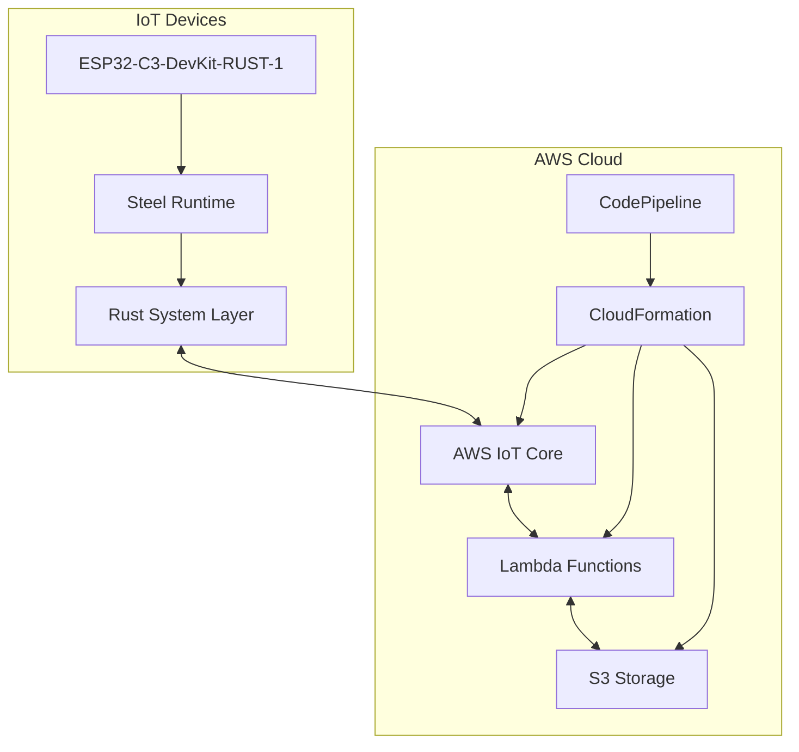

# AWS IoT Steel System - Production Deployment Package

## Overview

This production deployment package contains everything needed to deploy and operate the AWS IoT Steel System in production environments. The system enables dynamic Steel (Scheme) program execution on ESP32-C3-DevKit-RUST-1 devices through AWS IoT Core.

### Package Contents

```
production/
├── config/                     # Configuration files
│   ├── production.toml         # Production configuration
│   └── staging.toml           # Staging configuration
├── scripts/                   # Deployment and operational scripts
│   ├── deploy-production.sh   # Main deployment script
│   └── ...                   # Additional operational scripts
├── monitoring/               # Monitoring and alerting
│   ├── cloudwatch-dashboard.json
│   └── cloudwatch-alarms.yaml
├── docs/                     # Documentation
│   ├── production-deployment-guide.md
│   ├── steel-programming-guide.md
│   └── disaster-recovery-plan.md
└── README.md                 # This file
```

## Quick Start

### Prerequisites

1. **AWS Account** with appropriate permissions
2. **AWS CLI** configured with credentials
3. **Rust toolchain** installed
4. **ESP32 toolchain** (for hardware deployment)

### Basic Deployment

```bash
# 1. Clone and prepare
git clone https://github.com/your-org/aws-iot-steel.git
cd aws-iot-steel

# 2. Configure environment
export AWS_REGION=us-west-2
export DEPLOYMENT_BUCKET=your-deployment-bucket
export DEVICE_COUNT=10

# 3. Deploy to production
./production/scripts/deploy-production.sh \
  --environment production \
  --region us-west-2 \
  --device-count 10

# 4. Validate deployment
make validate-production
```

## System Architecture

### High-Level Components



### Key Features

- **Dynamic Programming**: Load and execute Steel programs remotely
- **Hardware Abstraction**: Cross-platform support (ESP32, macOS, Linux)
- **Cloud Integration**: Native AWS IoT Core connectivity
- **Security**: TLS 1.3, certificate-based authentication
- **Monitoring**: Comprehensive CloudWatch integration
- **CI/CD**: Automated deployment pipeline

## Configuration

### Environment-Specific Settings

The system supports multiple deployment environments:

- **Production**: `config/production.toml`
- **Staging**: `config/staging.toml`

Key configuration sections:

```toml
[system]
environment = "production"
log_level = "info"

[device]
device_type = "esp32-c3-devkit-rust-1"
device_count = 100

[aws]
region = "us-west-2"
iot_endpoint = "${IOT_ENDPOINT}"

[security]
tls_version = "1.3"
certificate_validation_enabled = true

[monitoring]
monitoring_enabled = true
alerting_enabled = true
```

### Customization

1. Copy the base configuration:
   ```bash
   cp production/config/production.toml production/config/production-custom.toml
   ```

2. Edit the custom configuration:
   ```bash
   vim production/config/production-custom.toml
   ```

3. Use the custom configuration in deployment:
   ```bash
   export CONFIG_FILE=production/config/production-custom.toml
   ./production/scripts/deploy-production.sh
   ```

## Deployment Options

### Standard Deployment

Deploy to a single AWS region with default settings:

```bash
./production/scripts/deploy-production.sh \
  --environment production \
  --region us-west-2 \
  --device-count 50
```

### Multi-Region Deployment

Deploy to multiple regions for high availability:

```bash
# Primary region
./production/scripts/deploy-production.sh \
  --environment production \
  --region us-west-2 \
  --device-count 75

# Secondary region
./production/scripts/deploy-production.sh \
  --environment production \
  --region us-east-1 \
  --device-count 25
```

### Staging Deployment

Deploy to staging environment for testing:

```bash
./production/scripts/deploy-production.sh \
  --environment staging \
  --region us-west-2 \
  --device-count 5
```

### Dry Run

Test deployment without making changes:

```bash
./production/scripts/deploy-production.sh \
  --environment production \
  --dry-run
```

## Monitoring and Alerting

### CloudWatch Dashboard

The system includes a comprehensive CloudWatch dashboard with:

- IoT Core message throughput
- Device connection status
- Steel program execution metrics
- System resource usage
- Security metrics
- OTA update status

Deploy the dashboard:

```bash
aws cloudwatch put-dashboard \
  --dashboard-name "AWS-IoT-Steel-Production" \
  --dashboard-body file://production/monitoring/cloudwatch-dashboard.json
```

### CloudWatch Alarms

Deploy monitoring alarms:

```bash
aws cloudformation deploy \
  --template-file production/monitoring/cloudwatch-alarms.yaml \
  --stack-name aws-iot-steel-production-alarms \
  --parameter-overrides \
    Environment=production \
    SNSTopicArn=arn:aws:sns:us-west-2:123456789012:alerts \
    DeviceCount=100
```

### Key Metrics

- **Connection Success Rate**: > 99%
- **Message Delivery Rate**: > 99.5%
- **Steel Program Execution Success**: > 95%
- **Average Response Time**: < 100ms
- **Memory Usage**: < 80%
- **CPU Usage**: < 70%

## Security

### Certificate Management

The system uses X.509 certificates for device authentication:

```bash
# Generate device certificates
./aws-infrastructure/scripts/provision-device.sh device-001 production us-west-2

# Check certificate expiration
aws iot describe-certificate --certificate-id CERTIFICATE_ID
```

### Security Best Practices

1. **Certificate Rotation**: Rotate certificates annually
2. **Least Privilege**: Use minimal IAM permissions
3. **Encryption**: Enable encryption at rest and in transit
4. **Monitoring**: Monitor for security events
5. **Updates**: Keep system components updated

### Security Validation

Run security validation tests:

```bash
make validate-security
```

## Operations

### Daily Operations

```bash
# Check system health
./production/scripts/check-system-health.sh

# Monitor device connectivity
./production/scripts/monitor-devices.sh

# Review logs
aws logs filter-log-events \
  --log-group-name /aws/iot/logsV2 \
  --start-time $(date -d '1 hour ago' +%s)000
```

### Weekly Operations

```bash
# Generate performance report
./production/scripts/generate-performance-report.sh

# Check certificate expiration
./production/scripts/check-certificate-expiration.sh

# Review security logs
./production/scripts/security-audit.sh
```

### Monthly Operations

```bash
# Capacity planning analysis
./production/scripts/analyze-capacity.sh

# Backup verification
./production/scripts/verify-backups.sh

# Disaster recovery test
./production/scripts/test-dr-procedures.sh --dry-run
```

## Steel Programming

### Basic Steel Program

```scheme
;; Simple LED blink program
(define (blink-program)
  (log "info" "Starting blink program")
  (led-on)
  (sleep 1)
  (led-off)
  (sleep 1)
  (log "info" "Blink complete"))

(blink-program)
```

### Sensor Monitoring Program

```scheme
;; Sensor monitoring with cloud reporting
(define (monitor-sensors)
  (let ((sensors (read-sensors)))
    (let ((temp (get sensors 'temperature))
          (humidity (get sensors 'humidity)))
      
      ;; Log readings
      (log "info" (format "Temp: ~a°C, Humidity: ~a%" temp humidity))
      
      ;; Send to cloud
      (mqtt-publish "sensors/data" (json-encode sensors))
      
      ;; Update device shadow
      (shadow-update "sensor-data" (json-encode sensors))
      
      ;; Check thresholds
      (when (> temp 30)
        (led-on)
        (mqtt-publish "alerts/temperature" 
                     (json-encode '((temperature . temp)
                                  (threshold . 30)
                                  (timestamp . (current-time))))))
      
      ;; Schedule next reading
      (set-timer "sensor-check" 60 monitor-sensors))))

;; Start monitoring
(monitor-sensors)
```

### Program Deployment

Deploy Steel programs to devices:

```bash
# Upload program to S3
aws s3 cp my-program.scm s3://aws-iot-steel-programs/my-program.scm

# Send program to specific device
aws iot-data publish \
  --topic "steel-programs/device-001/load" \
  --payload '{"program_id": "my-program", "auto_start": true}'

# Send program to all devices
aws iot-data publish \
  --topic "steel-programs/broadcast/load" \
  --payload '{"program_id": "my-program", "auto_start": true}'
```

## Troubleshooting

### Common Issues

#### Device Connection Failures

```bash
# Check device certificates
aws iot describe-certificate --certificate-id CERTIFICATE_ID

# Check IoT policies
aws iot get-policy --policy-name DevicePolicy

# Review connection logs
aws logs filter-log-events \
  --log-group-name /aws/iot/logsV2 \
  --filter-pattern "{ $.eventType = \"CONNECT\" && $.errorMessage EXISTS }"
```

#### Steel Program Failures

```bash
# Check program validation logs
aws logs filter-log-events \
  --log-group-name /aws/lambda/steel-program-validator \
  --filter-pattern "ERROR"

# Test program locally
cargo run --bin steel_test -- --file my-program.scm

# Check device logs
aws logs filter-log-events \
  --log-group-name /aws/iot/steel-runtime \
  --filter-pattern "ERROR"
```

#### High Resource Usage

```bash
# Check memory usage
aws cloudwatch get-metric-statistics \
  --namespace Custom/SteelRuntime \
  --metric-name MemoryUsage \
  --start-time $(date -u -d '1 hour ago' +%Y-%m-%dT%H:%M:%S) \
  --end-time $(date -u +%Y-%m-%dT%H:%M:%S) \
  --period 300 \
  --statistics Average,Maximum

# Identify resource-intensive programs
./production/scripts/identify-resource-usage.sh
```

### Support Escalation

1. **Level 1**: Check documentation and common issues
2. **Level 2**: Review logs and metrics
3. **Level 3**: Contact support team
4. **Level 4**: Escalate to AWS Support

## Disaster Recovery

### Backup Strategy

- **S3 Cross-Region Replication**: Real-time backup of programs and firmware
- **CloudFormation Templates**: Version-controlled infrastructure
- **Device Certificates**: Weekly backup to secure storage
- **Configuration Files**: Daily backup to S3

### Recovery Procedures

#### Complete Region Failure

```bash
# Switch to backup region
export AWS_DEFAULT_REGION=us-east-1

# Deploy infrastructure
./production/scripts/deploy-production.sh \
  --environment production \
  --region us-east-1

# Restore data
aws s3 sync s3://backup-bucket/ s3://primary-bucket/
```

#### Service Outage

```bash
# Check AWS Service Health
aws support describe-service-health

# Implement workarounds
./production/scripts/implement-workarounds.sh

# Monitor recovery
./production/scripts/monitor-recovery.sh
```

### Recovery Testing

```bash
# Monthly DR test
./production/scripts/test-disaster-recovery.sh --test-type monthly

# Quarterly full DR exercise
./production/scripts/test-disaster-recovery.sh --test-type quarterly
```

## Performance Optimization

### System Tuning

```bash
# Optimize Lambda functions
aws lambda update-function-configuration \
  --function-name steel-program-validator \
  --memory-size 512

# Configure provisioned concurrency
aws lambda put-provisioned-concurrency-config \
  --function-name steel-program-validator \
  --provisioned-concurrency-config ProvisionedConcurrencyCount=10
```

### Steel Program Optimization

```scheme
;; Use local variables for frequently accessed data
(let ((sensors (read-sensors)))
  (let ((temp (get sensors 'temperature)))
    ;; Process temp multiple times efficiently
    (process-temperature temp)))

;; Batch operations
(define readings '())
(when (>= (length readings) 10)
  (mqtt-publish "sensors/batch" (json-encode readings))
  (set! readings '()))
```

## Scaling

### Horizontal Scaling

```bash
# Add more devices
./production/scripts/provision-devices.sh \
  --start-id 101 \
  --count 50 \
  --environment production

# Deploy to additional regions
./production/scripts/deploy-production.sh \
  --environment production \
  --region eu-west-1 \
  --device-count 50
```

### Vertical Scaling

```bash
# Increase Lambda memory
aws lambda update-function-configuration \
  --function-name steel-program-validator \
  --memory-size 1024

# Scale IoT Core (automatic)
# IoT Core scales automatically based on usage
```

## Cost Optimization

### Cost Monitoring

```bash
# Check AWS costs
aws ce get-cost-and-usage \
  --time-period Start=2024-01-01,End=2024-01-31 \
  --granularity MONTHLY \
  --metrics BlendedCost

# Analyze IoT Core usage
aws iot get-statistics \
  --aggregation-field thingName
```

### Cost Reduction Strategies

1. **Right-size Lambda functions**: Use appropriate memory allocation
2. **Optimize message frequency**: Reduce unnecessary MQTT messages
3. **Use S3 lifecycle policies**: Archive old data to cheaper storage
4. **Reserved capacity**: Use reserved instances for predictable workloads

## Compliance and Governance

### Compliance Requirements

- **SOC 2**: Security and availability controls
- **ISO 27001**: Information security management
- **GDPR**: Data protection and privacy
- **HIPAA**: Healthcare data protection (if applicable)

### Governance Practices

1. **Change Management**: All changes through CI/CD pipeline
2. **Access Control**: Role-based access with MFA
3. **Audit Logging**: Comprehensive logging and monitoring
4. **Data Retention**: Automated data lifecycle management

## Support and Resources

### Documentation

- **Production Deployment Guide**: `docs/production-deployment-guide.md`
- **Steel Programming Guide**: `docs/steel-programming-guide.md`
- **Disaster Recovery Plan**: `docs/disaster-recovery-plan.md`
- **API Reference**: `docs/api-reference.md`

### Community Resources

- **GitHub Repository**: https://github.com/your-org/aws-iot-steel
- **Documentation Site**: https://docs.aws-iot-steel.com
- **Community Forum**: https://community.aws-iot-steel.com
- **Stack Overflow**: Tag `aws-iot-steel`

### Professional Support

- **Support Email**: support@aws-iot-steel.com
- **Enterprise Support**: enterprise@aws-iot-steel.com
- **Training Services**: training@aws-iot-steel.com

## License and Legal

### License

This software is licensed under the MIT License. See the LICENSE file for details.

### Third-Party Components

- **Rust**: MIT/Apache-2.0 License
- **Steel**: MIT License
- **AWS SDK**: Apache-2.0 License
- **ESP-IDF**: Apache-2.0 License

### Compliance

This software complies with:
- Export Administration Regulations (EAR)
- International Traffic in Arms Regulations (ITAR) - Not applicable
- General Data Protection Regulation (GDPR)

---

## Version Information

- **Package Version**: 1.0.0
- **Release Date**: 2024-01-01
- **Compatibility**: AWS IoT Core, ESP32-C3-DevKit-RUST-1
- **Minimum Requirements**: Rust 1.82+, AWS CLI 2.0+

---

*For additional support and documentation, visit our [documentation site](https://docs.aws-iot-steel.com) or contact our support team.*